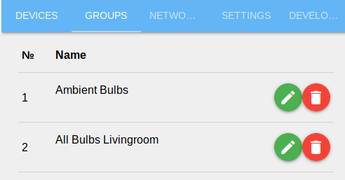
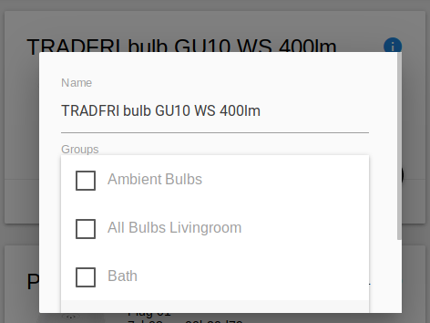
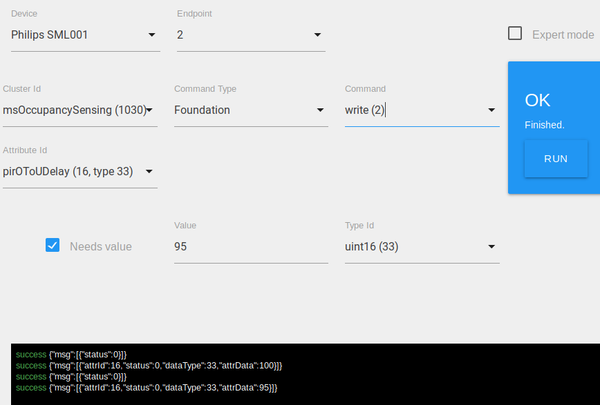

# ioBroker.zigbee

  

## ioBroker Zigbee adapter for Xiaomi (and other) devices via cc2531/cc2530

With the Zigbee-coordinator based on Texas Instruments SoC cc253x (and others), it creates its own zigbee-network, into which zigbee-devices are connected. By work directly with the coordinator, the driver allows you to manage devices without additional gateways / bridge from device manufacturers (Xiaomi / TRADFRI / Hue). About the device Zigbee-network can be read [here (in English)](https://www.zigbee2mqtt.io/information/zigbee_network.html).

## Hardware

For work, you need one of the following devices, flashed with a special ZNP firmware: [cc2531, cc2530, cc2530 + RF](https://github.com/Koenkk/zigbee2mqtt/wiki/Supported-sniffer-devices#zigbee-coordinator)

The necessary equipment for the firmware and the device preparation process are described [here (in English)](https://www.zigbee2mqtt.io/getting_started/what_do_i_need.html) or [here (in Russian)](https://github.com/kirovilya/ioBroker.zigbee/wiki/%D0%9F%D1%80%D0%BE%D1%88%D0%B8%D0%B2%D0%BA%D0%B0)

The devices connected to the Zigbee-network and inform the coordinator of their status and events (button presses, motion detection, temperature change). This information is reflected in the ioBroker object-states. Some ioBroker states have feedback and send commands to the zigbee-device when the value changes (switching the state of the outlet or lamp, changing the scene or the brightness of the lamp).

## Work with adapter

To start the driver, you must specify the name of the port on which the cc253x device is connected. Usually this is the port `/dev/ttyACM0` for cc2531 or `/dev/ttyUSB0` for the UART-connection cc2530. For Windows this will be the COM port number.

To connect devices, you need to switch the Zigbee-coordinator to pairing mode by pressing the green button. The countdown will begin (60 seconds) until the device connectivity is available.
To connect Zigbee devices in most cases, just press the pairing button on the device itself. But there are features for some devices. More information about pairing with devices can be found [here (in English)](https://www.zigbee2mqtt.io/getting_started/pairing_devices.html) or [here (in Russian)](https://github.com/kirovilya/ioBroker.zigbee/wiki#%D0%9F%D0%BE%D0%B4%D0%B4%D0%B5%D1%80%D0%B6%D0%B8%D0%B2%D0%B0%D0%B5%D0%BC%D1%8B%D0%B5-%D1%83%D1%81%D1%82%D1%80%D0%BE%D0%B9%D1%81%D1%82%D0%B2%D0%B0)

After successful pairing, the device appears in the configuration panel. If the device appears in the configuration panel but has the type "undefined", then this is an unknown device and can not be work with it. If the device is in the list of available devices, but added as "undefined", then try to remove the device and add it again.

### Device Groups
You may create groups of devices. 

It is a Zigbee feature, intended for example to switch bulbs synchronized. Assign groups via device tabs edit button. A group will show as own "device" in Objects.

Note: Not all devices support groups (not supported by end devices like sensors).

### Developer Tab

This is a tool for advanced users to test currently unsupported devices or enhance this adapters functionality. More instructions can be found on tab.

## Additional info

There is a [friendly project](https://github.com/koenkk/zigbee2mqtt) with similar functionality on the same technologies, where you can work with the same devices using the MQTT protocol. Therefore, if any improvements or support for new zigbee-devices occur in the Zigbee2MQTT project, we can transfer and add the same functionality to this adapter. If you notice this, then write the issue - we'll postpone it.

There are knowledge bases that can be useful for working with Zigbee-devices and equipment:
* in English https://www.zigbee2mqtt.io/
* in Russian https://github.com/kirovilya/ioBroker.zigbee/wiki

## Supported devices

Works with devices from this list https://github.com/ioBroker/ioBroker.zigbee/wiki/Supported-devices

## Plan

### 1.0.0 

* Binding

## Changelog

### 0.11.2 (2019-06-29)
* (allofmex) Hue sml sensitivity, Hue motion sensitivity
* (arteck) Innr RB 250 C, Gledopto GL-D-003Z, GL-G-001Z, GL-FL-004TZ, Philips LPT001
* (kirovilya) OSRAM CLA60 RGBW Z3, Xiaomi curtain ZNCLDJ11LM
* (kirovilya) Implement a time response for some xiaomi devices
* (arteck) Heiman smoke sensor, TRADFRI bulb E14 WS opal 600lm, Innr RB265

### 0.11.1 (2019-06-15)
* fix wrong initial extPanID. Sorry that need to repairing all devices again.
* fix code for aqara cube

### 0.11.0 (2019-06-14)
* Support both Z-Stack 1.2 and 3.0 [coordinator firmware](https://github.com/Koenkk/Z-Stack-firmware/tree/master/coordinator)
* Serialport 7.1.5
* (arteck) Adjustable time for pairing
* (kirovilya) Additional xiaomi plug states and decoupled mode for xiaomi wall switches
* (kirovilya) New DIY devices [ZigUP](https://github.com/formtapez/ZigUP) and [DIYRUZ_R4_5](http://modkam.ru/?p=1054)
* (arteck) JIAWEN FB56-ZCW08KU1.2, Nue / 3A FNB56-ZCW25FB1.9, HOMA1031, Trust CSW_ADUROLIGHT
* (allofmex) security update
* (allofmex) brightness fix 
* (Asgothian) Osram Gardenpole Mini
* (Asgothian) Innr Plugs (BY 265 C, BY 165 C, RB265 
* (Asgothian) Fix for Ikea Tradfri repeater (image)
* (sonntam) tint enhancements
* (stream2me) support for Danalock V3

### 0.10.3 (2019-03-27)
* fixes
* (kirovilya) Aqara Wireless Relay Controller, Smart LED Driver
* (asgothian) eCozy Thermostat, Nue / 3A, Gledopto GL-C-006 GL-C-009, Philips SML002, OSRAM Outdoor Lantern W RGBW, TRADFRI motion sensor
* (arteck) sensor_86sw2 new states
* (allofmex) Improved device configuration and network map
* (allofmex) security update
* (allofmex) brightness fix 

### 0.10.2 (2019-03-15)
* some fixes
* (allofmex) Visualize mesh newtwork map, "available" state, configuration requests
* (Apollon77) Update test framework
* (sonntam) Tint remote
* (arteck) OSRAM Lightify Switch Mini, rwl021 dimmer
* (asgothian) TRADFRI signal repeater, Innr SP 120, Xiaomi Gas detector

### 0.9.2 (2019-02-25)
No support of node.js 4 any more
* (bluefox) Xiaomi Lock was added
* (nisiode) Some fixes
* (sonntam) Some fixes
* (arteck) Heiman SmokeSensor
* (asgothian, allofmex) Eurotronic support

### 0.9.1 (2019-01-29)
* Groups and new Developer tab were added

### 0.9.0 (2019-01-28)
* (arteck) Many new devices
* (allofmex) Developer tab
* (modmax) Reading attributes
* (kirovilya) Groups support

### 0.8.0 (2018-11-29)

**BREAKING CHANGES**:
* (kirovilya) Rename state "isopen" to "opened".
* (kirovilya) Change brightness interval from 0..254 to 0..100 

Other changes:
* (kirovilya) Fix for admin2
* (kirovilya) + Gledopto
* (kirovilya) + Mijia vibration sensor
* (kirovilya) Common state "link_quality"
* (arteck) + Philips LLC010, LLC011, LLC012, LTW001, LTW004, LTW010, LTW012, LTC001, LCT024
* (arteck) + Osram PAR 16 50 RGBW - LIGHTIFY
* (arteck) + Innr RS 128 T, RS 185 C
* (arteck) + DE FLS-PP3
* (arteck) + Ilux LEColorLight
* (kirovilya) Light state "transition_time" for brightness, color, colortemp

### 0.7.7 (2018-10-21)
* (arteck) Fix 'is open' state

### 0.7.6 (2018-10-19)
* (kirovilya, arteck) New models and devices

### 0.7.5 (2018-10-02)
* (kirovilya) Support zigbee-shepherd-converters 4.*

### 0.7.4 (2018-10-01)
* (kirovilya) Allow enter port without selector

### 0.7.3 (2018-09-27)
* (arteck) Bugfix and new devices: Classic A60 W clear - LIGHTIFY and Surface Light TW
* (kirovilya) Occupancy timeout state for motion sensor
* (kirovilya) Serialport selector

### 0.7.1 (2018-08-14)
* (kirovilya) Network map feature
* (kirovilya) Allow pairing through router
* (kirovilya) Change battery percent interval to 2700..3200
* (arteck) New devices: Hue LTW010, Osram Flex RGBW
* (kirovilya) Triple and quadruple clicks for WXKG11LM
* (kirovilya) isopen - magnet state, in contrast to contact
* (kirovilya) Option "Disable LED for cc2531"

### 0.6.0 (2018-07-05)
* (kirovilya) More new devices from zigbee-shepherd-converters
* (kirovilya) Some layout fixes in admin
* (kirovilya) Fix battery for smoke sensor

### 0.5.9 (2018-06-27)
* (arteck) New devices: Osram LED PAR16, Osram Smart+ plug, Philips Hue bulb
* (kirovilya) Turn on/off lights when change brightness > 0 and = 0

### 0.5.8 (2018-06-26)
* (kirovilya) Allow backup/restore zigbee-database for js-controller 1.5.0
* (kirovilya) New device - Jiawen bulb
* (kirovilya) Allow remove device with setup key
* (from zigbee-shepherd-converters) Change battery percent interval to 3000-2700

### 0.5.7 (2018-06-19)
* (kirovilya) Update states on adapter start (for restored shepherd.db)
* (kirovilya) Brightness - not percent - range 0..255

### 0.5.6 (2018-06-14)
* (kirovilya) Configuration panID (zigbee network identifier)
* (kirovilya) Moved to ioBroker organization

### 0.5.5 (2018-06-11)
* (kirovilya) Return runing on NodeJS 4.*

### 0.5.4 (2018-06-10)
* (kirovilya) Public version

### 0.5.0 (2018-06-06)
* (kirovilya) All refactored

### 0.0.1 (2018-02-07)
* (kirovilya) First version

## License
The MIT License (MIT)

Copyright (c) 2018-2019 Kirov Ilya <kirovilya@gmail.com>

Permission is hereby granted, free of charge, to any person obtaining a copy
of this software and associated documentation files (the "Software"), to deal
in the Software without restriction, including without limitation the rights
to use, copy, modify, merge, publish, distribute, sublicense, and/or sell
copies of the Software, and to permit persons to whom the Software is
furnished to do so, subject to the following conditions:

The above copyright notice and this permission notice shall be included in
all copies or substantial portions of the Software.

THE SOFTWARE IS PROVIDED "AS IS", WITHOUT WARRANTY OF ANY KIND, EXPRESS OR
IMPLIED, INCLUDING BUT NOT LIMITED TO THE WARRANTIES OF MERCHANTABILITY,
FITNESS FOR A PARTICULAR PURPOSE AND NONINFRINGEMENT. IN NO EVENT SHALL THE
AUTHORS OR COPYRIGHT HOLDERS BE LIABLE FOR ANY CLAIM, DAMAGES OR OTHER
LIABILITY, WHETHER IN AN ACTION OF CONTRACT, TORT OR OTHERWISE, ARISING FROM,
OUT OF OR IN CONNECTION WITH THE SOFTWARE OR THE USE OR OTHER DEALINGS IN
THE SOFTWARE.
