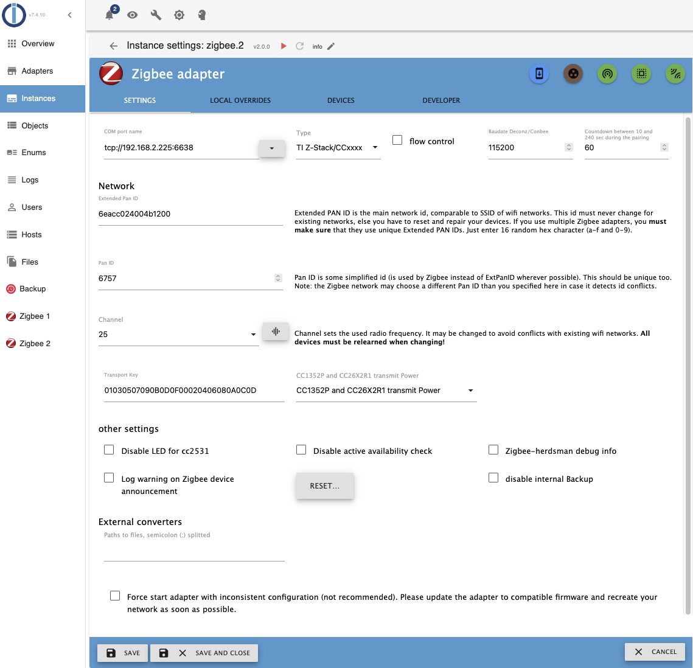
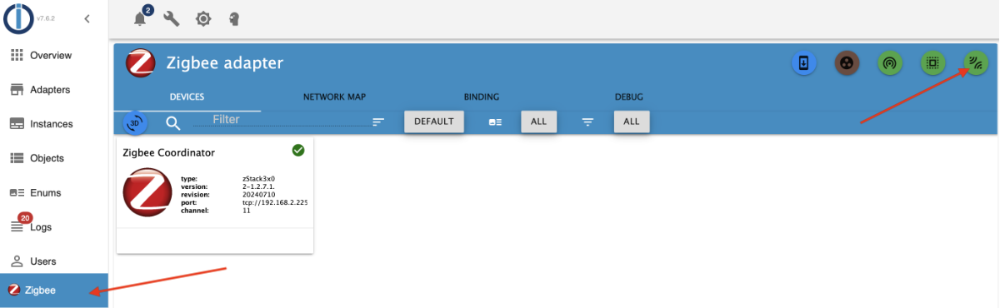

# ioBroker.zigbee

## ioBroker adapter for Zigbee devices via Zigbee coordinator hardware.

Using specialized Zigbee-coordinator hardware, the adapter creates and manages a Zigbee Network which can control and connect a large number of Zigbee Devices. The list of compatible devices inlcudes > 4000 devices from > 450 different vendors. The number of devices in the network depends on the available coordinator hardware. Common coordinator hardware are USB sticks with Texas Instruments CC26xx, Silicon Labs EZSP or ZIGate chipsetz. Some branded USB devices (Sonoff ZB-Dongle, Dresden Electronic Conbee) can also be used. There are also network-based hubs from various manufacturers.

By working directly with the coordinator, the driver allows you to manage devices without additional application / gateways / bridge from device manufacturers (Xiaomi / TRADFRI / Hue / Tuya). More information about the  Zigbee-network can be read [here (in English)](https://www.zigbee2mqtt.io/information/zigbee_network.html).

## Hardware

One coordinator device is required for each Zigbee Adapter instance. The device must be flashed with the respective coordinator firmware. A list of supported coordinators, the necessary equipment for the firmware and the device preparation process for different coordinator devices are described [here in English](https://www.zigbee2mqtt.io/guide/adapters/) or [smarthomescene.com ](https://smarthomescene.com/blog/best-zigbee-dongles-for-home-assistant-2023/) or [here in Russian](https://myzigbee.ru/books/%D0%BF%D1%80%D0%BE%D1%88%D0%B8%D0%B2%D0%BA%D0%B8/page/%D0%BF%D1%80%D0%BE%D1%88%D0%B8%D0%B2%D0%BA%D0%B0-cc2531cc2530)

### Texas Instruments SoC

Recommended devices are based on either the CC2652 or CC1352 chip. Devices based on cc253x chips are still supported but are no longer recommended.
Only CC26xx/cc1352/cc2538 Devices support extraction of the NVRam backup which should allow to swap coordinator hardware without having to reconnect all zigbee devices to the network.
Current firmware files for these devices can be found [on GitHub](https://github.com/Koenkk/Z-Stack-firmware)

### Dresden Elektronik SoC

As of May 2025, raspbee and conbee variants are no longer recommended, as the code is no longer actively maintained and has fallen behind the other variants with regards to functionality.

Conbee/RaspBee Support is no longer considered experimental in the zigbee-herdsman and zigbee-herdsman-converters libraries used by the zigbee Adapter, use of these devices with the adapter may limit functionality. Known issues are:
- link quality display may be incorrect
- device map metrics may be incorrect
- NVRam Backup is not supported.
- channel change is not supported.

### Silicon Labs SoC

Support for [Silicon Lab Zigbee](https://www.silabs.com/wireless/zigbee) based adapters is experimental. The initial support for EZSP v8 is still not yet considered stable, and the project is in need of more developers volunteering to help with this integration. Please refer to the respective documentation on [this page](https://www.zigbee2mqtt.io/guide/adapters/) and [ongoing development discussion](https://github.com/Koenkk/zigbee-herdsman/issues/319) with regards to the state of Silabs EmberZNet Serial Protocol (EZSP) adapter implementation integration into the zigbee-herdsman and zigbee-herdsman-converters libraries which it depends on.

### ZiGate SoC

Support for [ZiGate](https://zigate.fr) based adapters is experimental. The initial support for ZiGate is still not yet considered stable, and the project is in need of more developers volunteering to help with this integration. Please refer to the respective documentation on [this page](https://www.zigbee2mqtt.io/guide/adapters/) and [ongoing development discussion](https://github.com/Koenkk/zigbee-herdsman/issues/242) with regards to the state of ZiGate adapter implementation into the zigbee-herdsman and zigbee-herdsman-converters libraries which it depends on.

## Getting started

The adapter should **always** be installed from within the ioBroker Admin. Direct npm and GitHub installations are **not recommended**.

At first start, it is vital to set up the adapter settings. These include:
- the communication to the zigbee Coordinator (COM Port). This can be a device identifier or a network address for Network-based coordinators
- the required firmware-Type
- the network parameters PanID (a number between 0 and 65565), extended PanID (a 16 digit HEX number) and the zigbee Channel **important: Do not run the adapter without changing the values for PanID (6754) and Extended PanID (DDDDDDDDDDDDDDDD) to unique values for your Zigbee Installation.**

The *Test Port* and *Star/Stop* buttons are provided to test the settings.

**Once the settings are verified the adapter can be prepared for automatic start by setting the CheckBox *start the zigbee network automatically* and saving the parameters.**

Please refer to the [in depth documentation](docs/en/readme.md) ([german version](docs/de/readme.md), [russian version](docs/ru/readme.md)) for a detailed explanation on how to configure the adapter.

Once the adapter is up and running, the desired devices need to be integrated into the network. This requires for both the adapter and the device to be in pairing mode. Most new devices will be in pairing-mode when they are powered up for the first time, but some will require a special procedure for this. Please refer to the device manual for information on this.

The adapter is placed in pairing mode by pressing the pairing button:

A dialog showing a pairing countdown appears. When a new device is discovered, interviewed and paired with the network, messages will be shown in this dialog, and the device will show up in the grid of active devices. Any known device should show up with an image and the correct device name, as well as a number of changable settings. Any unknown device will show up with a device name and a ? as icon, while devices which failed the pairing will show up as 'unknown' with the same ? icon. These should be removed from the network to be paired again. Please refer to the documentation linked above for more details.

## Advanced options

### Groups

The adapter allows for the creation of groups via the 'add group' button. Once a group has been formed, devices can be added to and removed from the group from the device card. Removal is also possible from the group card.
Groups have the advantage that a single command is sent to control all group members. This is especially helpful when changing the groups brightness and/or color settings.
Note that not all devices may be added to groups - the device itself needs to support this feature.

Group configuration is available from the device grid.

### Bindings

Bindings can be used to link a remote control directly to a device, like it is e.g. done for the ikea devices. This binding has the advantage that bound devices will continue to work together even if the Zigbee Coordinator is unavailable.
Note that not all devices may be part of a binding - the devices themselves need to support this feature.

The binding configuration is only available from the zigbee tab

### Network Map

The adapter has the ability to generate a map of the mesh network. This usually takes a few minutes and provides a momentary glimpse into how the devices are meshed with each other.

The network map is only available the zigbee tab.

### Debug information

The Adapter offers to collect debug information for specific devices in order to identify problems in device operation and integration. This needs to be enabled on the desired devices from the device grid.

The debug information is only available from the zigbee tab.

### Local overrides

Device integration can be modified on a *per Model* basis, allowing the user to customise the states associated with the device. Note that before version 2.1.0, this is limited to choosing between the default *expose based* integration and the previous *legacy* integration. More options for customisation are under development.

The local overrides are only available from the instance configuration

### Developer Mode

The developer mode offers the ability to communicate with any paired device solely based on the details of the Zigbee communication rules. Use of this requires an insight into Zigbee Clusters, Attributes and messaging structure. It can be used to control devices which are not currently supported. An in depth desctiption of the developer Tab is available in the documentation.

The developer tab is only available from the instance configuration

## Additional info

There is a [friendly project](https://github.com/koenkk/zigbee2mqtt) with similar functionality which is based on the same technology. It uses the same base libraries for hardware communication and device integration. Any device listed as compatible in this project is likely to be compatible with the ioBroker.zigbee Adapter. Note that there is a delay between device integration into zigbee2mqtt.io and the Zigbee-Adapter, as compatibility with the hardware libraries requires verification before the adapter can move to the latest version.

There are knowledge bases that can be useful for working with Zigbee-devices and equipment:
* in English https://www.zigbee2mqtt.io/ or https://zigbee.blakadder.com
* in Russian https://myzigbee.ru/

## Supported devices

Pleae refer to [this list](https://www.zigbee2mqtt.io/supported-devices/) to check compatibility. Once a device is listed as compatible there, it is either already compatible with the Zigbee Adapter or can be made compatible using an external converter.

## In Depth Documentation

[in Deutsch](https://github.com/ioBroker/ioBroker.zigbee/blob/master/docs/de/readme.md)

[in English](https://github.com/ioBroker/ioBroker.zigbee/blob/master/docs/en/readme.md)

or

[wiki](https://github.com/ioBroker/ioBroker.zigbee/wiki)

## Donate

You can thank the authors by these links:
* to Arthur Rupp https://paypal.me/ArthurRupp

-----------------------------------------------------------------------------------------------------
## Changelog
### 3.0.1 (2025-04-25)
* (AlexHaxe)  Fix for Ikea SOMRIG configuration raising 'definition.endpoint is not a function' error.
* (asgothian) Access to 'zigbee2mqtt options as settings in zigbee adapter (ALPHA Stage !)
* (asgothian) Fix for 'error: zigbee.0 (1118300) zigbee.0 already running' at adapter start (Alpha Stage)
* (asgothian) Updated hardware configuration panel - exchanged text buttons for buttons with icons.
* (asgothian) Limited states on device tiles to states which are read only or which can be modified sensibly via the device tile.
*

### 3.0.0 (2025-04-08)
* (asgothian) Breaking change: Start of zigbee subsystem requires checking the 'start the Zigbee network automatically' checkbox. !!!
* (asgothian) Hardware configuration panel
* (asgothian) Update for external converter - detect /dist/ subfolder
* (asgothian) Update device image: use of icons defined in external converter (beta)
*

### 2.0.5 (2025-03-25)
* (asgothian) ZHC 23.6.0
* (asgothian) ZH 3.3.x
* (asgothian) removed extra logging
* (asgothian) fixed memory issue.
* (asgothian) Configure on Message - 5 attempts.
* (arteck) update transmitPower
* (asgothian) fix crash in ZigbeeController.ByteArrayToString
* (AlexHaxe) device designation for  devices without mapped model (allows use in groups and bindings)
*

### 2.0.4 (2025-03-09)
* (arteck) back to 2.0.2

### 2.0.3 (2025-03-07)
* (asgothian) fix configured info
* (asgothian) fix battery voltage (V -> mV)
* (asgothian) enable debug interface v1.0
* (asgothian) Push Zigbee-Herdsman to 2.5.7
* (asgothian) Push Zigbee-Herdsman-Converters to 23.1.1
* (asgothian) fix configure on message
* (asgothian) remove extra warning messages
* (asgothian) fix Adapter-Checker notes
* (asgothian) improve base64 image detection
* (asgothian) removed unused adaptert objects (info.groups, excludes) from adapter config

### 2.0.2 (2025-03-02)
* (asgothian)  expose generation with expose function requiring a device. (Issue #1842)
* (asgothian) fix failure to configure for devices needing multiple configurations (Issue #2375)
* (asgothian) fix hold/release and press/release action handling (Issue #2387)
* (asgothian) fix lib/legacy requirement for external converters (Issue #2376)
* (asgothian) improved external converter handling
* (asgothian) fix OTA bug
* (asgothian) improved message handling for devices which report values outside their defined ranges
* (asgothian) preparation for ZHC 22.x (model definition loaded on demand
* (asgothian) fix legacy definition for devices
* (asgothian) added action state for remotes.
*

### 2.0.1 (2025-02-25)
* BREAKING CHANGES
*
* switch to converters 21 changes the exposes for a large numbern of devices (mostly remotes)
* new method for controlling color based on subchannels for rgb, hs and xy
* Exposes as default for ALL devices. Use of old definition as option only
* Requires Node 20.x or newer
*
* (asgothian) Fix Pairing
* (asgothian) change ping
* (asgothian) delay map generation until refresh is activated, map messages after generation
* (asgothian) remove bindings tab from zigbee tab
* (asgothian) reorder tabs in configuration
* (asgothian) remove binding tab from configuration
* (asgothian) remove map from configuration
* (asgothian) add debug to zigbee tab
* (asgothian) Herdsman 3.2.5, Converters 21.30.0
* (asgothian) Exposes as default, use of old device definitions as legacy optional
* (asgothian) User specific images (model based, device based)
* (asgothian) Improved group editing - remove members from group card

### 1.10.14 (2025-01-01)
* (arteck) Herdsman 2.1.9, Converters 20.58.0
* (asgothian) Fix: Aqara T1M (CL-L02D)
* (arteck) deleteDeviceStates change to deleteObj

### 1.10.13 (2024-11-10)
* (arteck) corr icon download bug (axios)

### 1.10.12 (2024-11-03)
* (asgothian) corr Channel Scan

### 1.10.11 (2024-11-02)
* BREAKING CHANGE
*
*  bugs : ChannelScan is currently not available
*
*
* (lebrinkma) fix linter errors
* (asgothian) disable map display for deactivated devices
* (asgothian) new option on map: disable physics interaction
* (asgothian) new zigbee-herdsman-converters 20.28.0
* (asgothian) new zigbee-herdsman 2.1.1
* (asgothian) Allow use of keyless converters (used for TuYa and compatible devices in zigbee-herdsman-converters
* (arteck) swap from request to axios
* (arteck) delete groups works again

### 1.10.9 (2024-09-05)
* (arteck) typo admin settings
* (arteck) eslint config

### 1.10.8 (2024-09-05)
* (arteck) corr admin settings
* (arteck) add new eslint version

### 1.10.7 (2024-09-05)
* (arteck) add flow control option
* (asgothian) add new NewHerdsman
* (arteck) add new ezsp coordinator Firmware (7.4.1.0)

### 1.10.5 (2024-06-21)
* (arteck) icon ota device update
* (arteck) icon fix

### 1.10.4 (2024-04-20)
* (arteck) core update
* (arteck) dependency update

### 1.10.3 (2024-04-06)
* (arteck) dependency update

### 1.10.2 (2024-01-25)
* (arteck) dependency update

### 1.10.1 (2024-01-21)
* (arteck) Baudrate is now configurable. works ONLY with Deconz/Conbee(38400)
* (arteck) add nvbackup.json delete button

### 1.10.0 (2024-01-13)
* (arteck) new zigbee-herdsman-converters 18.x
* (arteck) configure message is now a warning

 ***********************************************

### 1.0.0 (2020-01-22)
* Powered by new [zigbee-herdsman](https://github.com/Koenkk/zigbee-herdsman) library and new [converters database](https://github.com/Koenkk/zigbee-herdsman-converters)
* Drop support NodeJS 6
* Serialport 8.0.5 (in zigbee-herdsman)
* More new devices
* Some design update
* Binding

------------------------------------------------------------------------------

## License
The MIT License (MIT)

Copyright (c) 2018-2025 Kirov Ilya <kirovilya@gmail.com>

Permission is hereby granted, free of charge, to any person obtaining a copy
of this software and associated documentation files (the "Software"), to deal
in the Software without restriction, including without limitation the rights
to use, copy, modify, merge, publish, distribute, sublicense, and/or sell
copies of the Software, and to permit persons to whom the Software is
furnished to do so, subject to the following conditions:

The above copyright notice and this permission notice shall be included in
all copies or substantial portions of the Software.

THE SOFTWARE IS PROVIDED "AS IS", WITHOUT WARRANTY OF ANY KIND, EXPRESS OR
IMPLIED, INCLUDING BUT NOT LIMITED TO THE WARRANTIES OF MERCHANTABILITY,
FITNESS FOR A PARTICULAR PURPOSE AND NONINFRINGEMENT. IN NO EVENT SHALL THE
AUTHORS OR COPYRIGHT HOLDERS BE LIABLE FOR ANY CLAIM, DAMAGES OR OTHER
LIABILITY, WHETHER IN AN ACTION OF CONTRACT, TORT OR OTHERWISE, ARISING FROM,
OUT OF OR IN CONNECTION WITH THE SOFTWARE OR THE USE OR OTHER DEALINGS IN
THE SOFTWARE.
