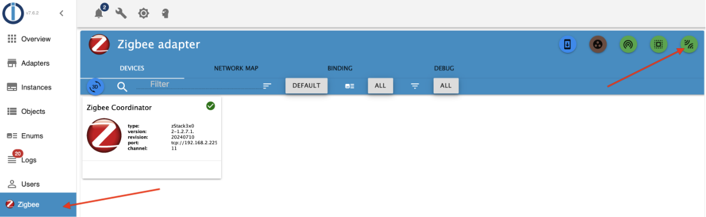

# ioBroker.zigbee

## ioBroker adapter for Zigbee devices via Zigbee coordinator hardware.

Using specialized Zigbee-coordinator hardware, the adapter creates and manages a Zigbee Network which can control and connect a large number of Zigbee Devices. The list of compatible devices inlcudes > 4000 devices from > 450 different vendors. The number of devices in the network depends on the available coordinator hardware. Common coordinator hardware are USB sticks with Texas Instruments CC26xx, Silicon Labs EZSP or ZIGate chipsetz. Some branded USB devices (Sonoff ZB-Dongle, Dresden Electronic Conbee) can also be used. There are also network-based hubs from various manufacturers.

By working directly with the coordinator, the driver allows you to manage devices without additional application / gateways / bridge from device manufacturers (Xiaomi / TRADFRI / Hue / Tuya). More information about the  Zigbee-network can be read [here (in English)](https://www.zigbee2mqtt.io/information/zigbee_network.html).

## Hardware

One coordinator device is required for each Zigbee Adapter instance. The device must be flashed with the respective coordinator firmware. A list of supported coordinators, the necessary equipment for the firmware and the device preparation process for different coordinator devices are described [here in English](https://www.zigbee2mqtt.io/guide/adapters/) or [smarthomescene.com ](https://smarthomescene.com/blog/best-zigbee-dongles-for-home-assistant-2023/) or [here in Russian](https://myzigbee.ru/books/%D0%BF%D1%80%D0%BE%D1%88%D0%B8%D0%B2%D0%BA%D0%B8/page/%D0%BF%D1%80%D0%BE%D1%88%D0%B8%D0%B2%D0%BA%D0%B0-cc2531cc2530)

### Texas Instruments SoC

Recommended devices are based on either the CC2652 or CC1352 chip. Devices based on cc253x chips are still supported but are no longer recommended.
Only CC26xx/cc1352/cc2538 Devices support extraction of the NVRam backup which should allow to swap coordinator hardware without having to reconnect all zigbee devices to the network.
Current firmware files for these devices can be found [on GitHub](https://github.com/Koenkk/Z-Stack-firmware)

### Dresden Elektronik SoC

Conbee/RaspBee Support is no longer considered experimental in the zigbee-herdsman and zigbee-herdsman-converters libraries used by the zigbee Adapter, use of these devices with the adapter may limit functionality. Known issues are:
- link quality display may be incorrect
- device map metrics may be incorrect
- NVRam Backup is not currently supported.
- channel change is not currently supported.

### Silicon Labs SoC

Support for [Silicon Lab Zigbee](https://www.silabs.com/wireless/zigbee) based adapters is experimental. The initial support for EZSP v8 is still not yet considered stable, and the project is in need of more developers volunteering to help with this integration. Please refer to the respective documentation on [this page](https://www.zigbee2mqtt.io/guide/adapters/) and [ongoing development discussion](https://github.com/Koenkk/zigbee-herdsman/issues/319) with regards to the state of Silabs EmberZNet Serial Protocol (EZSP) adapter implementation integration into the zigbee-herdsman and zigbee-herdsman-converters libraries which it depends on.

### ZiGate SoC

Support for [ZiGate](https://zigate.fr) based adapters is experimental. The initial support for ZiGate is still not yet considered stable, and the project is in need of more developers volunteering to help with this integration. Please refer to the respective documentation on [this page](https://www.zigbee2mqtt.io/guide/adapters/) and [ongoing development discussion](https://github.com/Koenkk/zigbee-herdsman/issues/242) with regards to the state of ZiGate adapter implementation into the zigbee-herdsman and zigbee-herdsman-converters libraries which it depends on.

## Getting started

The adapter should **always** be installed from within the ioBroker Admin. Direct npm and GitHub installations are **not recommended**.

At first start, it is vital to set up the adapter settings.
Please refer to the [in depth documentation](docs/en/readme.md) ([german version](docs/de/readme.md), [russian version](docs/ru/readme.md)) and/or the [wiki](https://github.com/ioBroker/ioBroker.zigbee/wiki) for more information and a step-by-step guide on how to configure the adapter.

Once the adapter is up and running, the desired devices need to be integrated into the network. This requires for both the adapter and the device to be in pairing mode. Most new devices will be in pairing-mode when they are powered up for the first time, but some will require a special procedure for this. Please refer to the device manual for information on this.

The adapter is placed in pairing mode by pressing the pairing button:

A dialog showing a pairing countdown appears. When a new device is discovered, interviewed and paired with the network, messages will be shown in this dialog, and the device will show up in the grid of active devices. Any known device should show up with an image and the correct device name, as well as a number of changable settings. Any unknown device will show up with a device name and a ? as icon, while devices which failed the pairing will show up as 'unknown' with the same ? icon. These should be removed from the network to be paired again. Please refer to the documentation linked above for more details.

## Configuration Tabs

The adapter configuration is done completely and solely through the instance settings. It is split into 4 sections, which are covered in detail below. Within the instance settings, there is only limited access to operational functionalities. There is no controllable list of devices, nor is there access to advanced pairing modes or device-level configurations. Instead, the configuration offers the option to rebuild the states and/or trigger a device image download through the Zigbee adapter buttons.

### SETTINGS

This tab contains the general adapter settings. Most of the adapter behaviour is configured on this tab.

It also include the setting for external converters, which currently read relative to 2 folders:
- The adapters Data folder, i.e. the folder where the `sheperd.db`, `nvbackup.json` and `LocalOverrides.json` are located
- The adapters internal storage of external converters, i.e. `iobroker.zigbee/converters`.

Any user who whishes to share their external converters with the users of the adapter can open an issue or PR to have them added to the `converters` repository. **Note:** The adapter developers will **not** maintain these external converters. Each converter accepted into the repository will need to include some form of author identification.

External converters are only loaded **when configured**, i.e. without the respective entry in the External converters field, they will remain unused.

Changes to this tab trigger an automatic restart of the adapter upon leaving the settings.

### HARDWARE

This tab contains the Zigbee-Hardware specific settings. Network and Coordinator parameters are set in this tab. It also offers the option to test hardware related settings **without** saving them, giving the user the ability to see how a change in hardware parameters will affect their network. Local backup/restore options for zigbee-adapter local data (Zigbee database, NVRam backup and Local Overrides) are also provided.

**Note** This tab also contains the option if to start the zigbee network automatically.

Changes to this tab trigger an automatic restart of the adapter upon leaving the settings.

### LOCAL DATA

This tab offers the option to do model-level configuration for device behaviour. Currently, model Options, the default device name and the default device Icon can be set through this tab. Most of the advanced options from Z2M are made available for configuration here. It also offers the option to delete devices.

Changes to this tab **do not** trigger an automatic restart of the adapter upon leaving the settings.

### DEVELOPER

The developer tab offers the option to communicate directly with the device based on ZCL Clusters and attributes. Proper use of this requires access to the cluster definition as well as additional device specific documentation. The results generated through this help with generating an external converter for a currently unknown device.

Changes to this tab **do not** trigger an automatic restart of the adapter upon leaving the settings.

## Sidebar Tabs

Most of the 'normal' operation of the adapter should be performed using the sidebar tabs. Through the Zigbee adapter buttons, the tab offers the ability to
- trigger a firmware update check for all devices
- create a new group
- perform a touchlink reset
- pair devices which require a pairing code

### Devices

The devices tab shows the device tiles, which offer access to a subset of states to display / control for each device, as well as general information on the device. Device tiles can be flipped over to reveal additional information and a row of buttons which allow the operator to rename the devivc, assign device-level options, change the device icon, enable/disable the device or per-device debug and reconfigure the device and manage group membership of devices which can join groups.

### Network Map

The network map shows **a Snapshot** of the mesh network. The accuracy of the snapshot relies heavily on the stability of the network and the willingness of the included devices to respond to LQI and Routing requests. After the adapter is started, the map is inactive and incomplete. It must first be generated using the button on the map background or from the map settings. Once a map was generated, it is available in any openend browser window or tab without regeneration. Generating the map can take several minutes to complete, during which time an additional button will appear in the title bar to show the progress.

## Additional info

There is a [friendly project](https://github.com/koenkk/zigbee2mqtt) with similar functionality which is based on the same technology. It uses the same base libraries for hardware communication and device integration. Any device listed as compatible in this project is likely to be compatible with the ioBroker.zigbee Adapter. Note that there is a delay between device integration into zigbee2mqtt.io and the Zigbee-Adapter, as compatibility with the hardware libraries requires verification before the adapter can move to the latest version.

There are knowledge bases that can be useful for working with Zigbee-devices and equipment:
* in English https://www.zigbee2mqtt.io/ or https://zigbee.blakadder.com
* in Russian https://myzigbee.ru/

## Supported devices

Pleae refer to [this list](https://www.zigbee2mqtt.io/supported-devices/) to check compatibility. Once a device is listed as compatible there, it is either already compatible with the Zigbee Adapter or can be made compatible using an external converter.

## Donate

You can thank the authors by these links:
* to Arthur Rupp https://paypal.me/ArthurRupp

-----------------------------------------------------------------------------------------------------
## Changelog
### 3.4.10 (2026-06-27)
* DM-Utils 3.x
* improved device manager support
* fixed Developer Tab
* ZHC 26.73.0
* ZH 10.5.0
* default model options for BSD-2
* additional role definitions

### 3.4.9 (2026-06-22)
* (asgothian) Removed 'forced configure on start'
* (krobipd) - various bugfixes
* (asgothian) - updated versioning for adapter options

### 3.4.8 (2026-06-16)
* Bugfix - state publishing

### 3.4.7 (2026-06-15)
* Fix: Controlling groups
* Fix: Pairing battery powered devices

### 3.4.6 (2026-06-11)
* Fix: Option meta_message
* Fix: zigbee network on tcp connection loss
* ZH 10.3
* ZHC 26.63
* state controlled OTA

## License
The MIT License (MIT)

Copyright (c) 2018-2026 Kirov Ilya <kirovilya@gmail.com>

Permission is hereby granted, free of charge, to any person obtaining a copy
of this software and associated documentation files (the "Software"), to deal
in the Software without restriction, including without limitation the rights
to use, copy, modify, merge, publish, distribute, sublicense, and/or sell
copies of the Software, and to permit persons to whom the Software is
furnished to do so, subject to the following conditions:

The above copyright notice and this permission notice shall be included in
all copies or substantial portions of the Software.

THE SOFTWARE IS PROVIDED "AS IS", WITHOUT WARRANTY OF ANY KIND, EXPRESS OR
IMPLIED, INCLUDING BUT NOT LIMITED TO THE WARRANTIES OF MERCHANTABILITY,
FITNESS FOR A PARTICULAR PURPOSE AND NONINFRINGEMENT. IN NO EVENT SHALL THE
AUTHORS OR COPYRIGHT HOLDERS BE LIABLE FOR ANY CLAIM, DAMAGES OR OTHER
LIABILITY, WHETHER IN AN ACTION OF CONTRACT, TORT OR OTHERWISE, ARISING FROM,
OUT OF OR IN CONNECTION WITH THE SOFTWARE OR THE USE OR OTHER DEALINGS IN
THE SOFTWARE.
