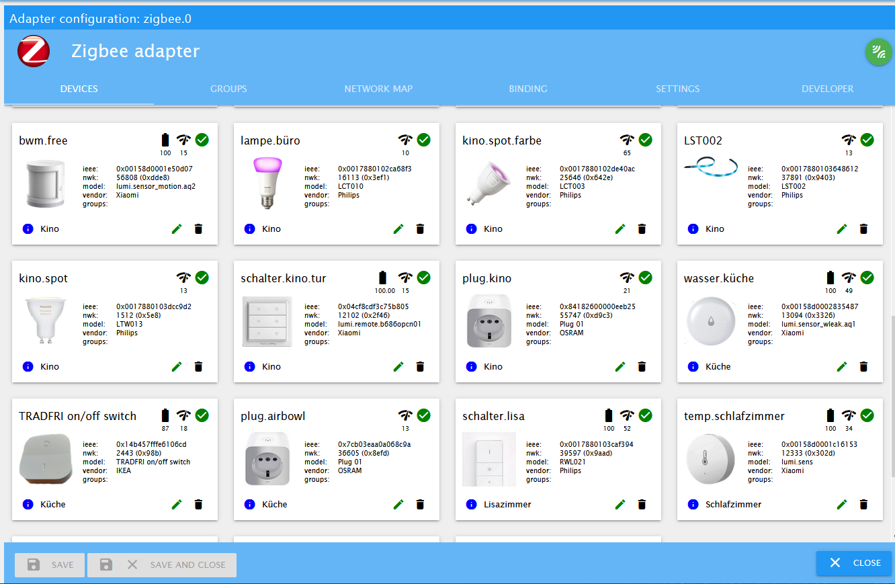

# ioBroker.zigbee

## ioBroker adapter for Zigbee devices via TI cc26x2r/cc2538/cc26x2px and deCONZ ConBee/RaspBee.
### cc2531/cc2530 are obsolet

With the Zigbee-coordinator based on Texas Instruments SoC, deCONZ ConBee/RaspBee modules, Silicon Labs EZSP v8 or ZIGate USB-TTL it creates its own zigbee-network, into which zigbee-devices are connected.

By working directly with the coordinator, the driver allows you to manage devices without additional application / gateways / bridge from device manufacturers (Xiaomi / TRADFRI / Hue / Tuya). About the device Zigbee-network can be read [here (in English)](https://www.zigbee2mqtt.io/information/zigbee_network.html).

## Hardware

One coordinator device is required for each zigbee Adapter instance. The device must be flashed with the respective coordinator firmware. A list of supported coordinators, the necessary equipment for the firmware and the device preparation process for different coordinator devices are described [here in English](https://www.zigbee2mqtt.io/guide/adapters/) or [smarthomescene.com ](https://smarthomescene.com/blog/best-zigbee-dongles-for-home-assistant-2023/) or [here in Russian](https://myzigbee.ru/books/%D0%BF%D1%80%D0%BE%D1%88%D0%B8%D0%B2%D0%BA%D0%B8/page/%D0%BF%D1%80%D0%BE%D1%88%D0%B8%D0%B2%D0%BA%D0%B0-cc2531cc2530)

### Texas Instruments SoC

Recommended devices are based on either the CC2652 or CC1352 chip. Devices based on cc253x chips are still supported but are no longer recommended.
Only CC26xx/cc1352/cc2538 Devices support extraction of the NVRam backup which should allow to swap coordinator hardware without having to reconnect all zigbee devices to the network.
Current firmware files for these devices can be found [on GitHub](https://github.com/Koenkk/Z-Stack-firmware)

tutorial/zigbee.png
### Dresden Elektronik SoC

recommended:
- ConBee II
- RaspBee II

no longer recommended:
- ConBee I
- RaspBee

While Conbee/RaspBee Support is no longer considered experimental in the zigbee-herdsman and zigbee-herdsman-converters libraries used by the zigbee Adapter, use of these devices with the adapter may limit functionality. Known issues are:
- link quality display may be incorrect
- device map metrics may be incorrect
- NVRam Backup is not supported.

### Silicon Labs SoC

Support for [Silicon Lab Zigbee](https://www.silabs.com/wireless/zigbee) based adapters is experimental. The initial support for EZSP v8 is still not yet considered stable, and the project is in need of more developers volunteering to help with this integration. Please refer to the respective documentation on [this page](https://www.zigbee2mqtt.io/guide/adapters/) and [ongoing development discussion](https://github.com/Koenkk/zigbee-herdsman/issues/319) with regards to the state of Silabs EmberZNet Serial Protocol (EZSP) adapter implementation integration into the zigbee-herdsman and zigbee-herdsman-converters libraries which it depends on.

### ZiGate SoC

Support for [ZiGate](https://zigate.fr) based adapters is experimental. The initial support for ZiGate is still not yet considered stable, and the project is in need of more developers volunteering to help with this integration. Please refer to the respective documentation on [this page](https://www.zigbee2mqtt.io/guide/adapters/) and [ongoing development discussion](https://github.com/Koenkk/zigbee-herdsman/issues/242) with regards to the state of ZiGate adapter implementation into the zigbee-herdsman and zigbee-herdsman-converters libraries which it depends on.

## Work with adapter

To start the driver, you must specify the name of the port on which the Zigbee module (stick) is connected. Usually this is the port `/dev/ttyACM0` or `/dev/ttyUSB0` for the UART-connection. Or you can find with `ls -l /dev/serial/by-id` the device direct.

open the settings and change port

For Windows, this will be the COM port number.

Starting from version 1.0.0, you can also use *tcp connection* for cases using esp8266 (or other microcontrollers) as serial-bridge. For example `tcp://192.168.1.46:8880`. Read more info here https://www.zigbee2mqtt.io/information/connecting_cc2530#via-an-esp8266

To connect devices, you need to switch the Zigbee coordinator to pairing mode by pressing the green button. The countdown will begin (60 seconds) until the device connectivity is available.
To connect Zigbee devices in most cases, just press the pairing button on the device itself. But there are features for some devices. More information about pairing with devices can be found [here (in English)](https://www.zigbee2mqtt.io/getting_started/pairing_devices.html)

After successful pairing, the device appears in the configuration panel. If the device appears in the configuration panel but has the type "undefined", then this is an unknown device and cannot be worked with it. If the device is in the list of available devices, but added as "undefined", then try to remove the device and add it again.

The devices connected to the Zigbee-network and inform the coordinator of their status and events (button presses, motion detection, temperature change). This information is reflected in the ioBroker object-states. Some ioBroker states have feedback and send commands to the zigbee-device when the value changes (switching the state of the outlet or lamp, changing the scene or the brightness of the lamp).

### Device Groups
You may create groups of devices.

It is a Zigbee feature, intended for example to switch bulbs synchronized. Assign groups via device tabs edit button. A group will show as own "device" in Objects.

Note: Not all devices support groups (not supported by end devices like sensors).

### Binding

https://www.zigbee2mqtt.io/information/binding

### Developer Tab

This is a tool for advanced users to test currently unsupported devices or enhance this adapter's functionality. More instructions can be found on the tab.

## Additional info

There is a [friendly project](https://github.com/koenkk/zigbee2mqtt) with similar functionality on the same technologies, where you can work with the same devices using the MQTT protocol. Therefore, if any improvements or support for new zigbee-devices occur in the Zigbee2MQTT project, we can transfer and add the same functionality to this adapter. If you notice this, then write the issue - we'll postpone it.

There are knowledge bases that can be useful for working with Zigbee-devices and equipment:
* in English https://www.zigbee2mqtt.io/
* in Russian https://myzigbee.ru/

## Supported devices

[Works with devices from this list](https://github.com/ioBroker/ioBroker.zigbee/wiki/Supported-devices)

## More Information

[in Deutsch](https://github.com/ioBroker/ioBroker.zigbee/blob/master/docs/de/readme.md)

[in English](https://github.com/ioBroker/ioBroker.zigbee/blob/master/docs/en/readme.md)

or

[wiki](https://github.com/ioBroker/ioBroker.zigbee/wiki)

## Donate

You can thank the authors by these links:
* to Arthur Rupp https://paypal.me/ArthurRupp

-----------------------------------------------------------------------------------------------------
## Changelog
### **WORK IN PROGRESS**
### 2.0.0 (2025-02-21)
* BREAKING CHANGES
*
* switch to converters 21 changes the exposes for a large numbern of devices (mostly remotes)
* new method for controlling color based on subchannels for rgb, hs and xy
* Exposes as default for ALL devices. Use of old definition as option only
* Requires Node 20.x or newer
*
* (asgothian) Fix Pairing
* (asgothian) change ping
* (asgothian) delay map generation until refresh is activated, map messages after generation
* (asgothian) remove bindings tab from zigbee tab
* (asgothian) reorder tabs in configuration
* (asgothian) remove binding tab from configuration
* (asgothian) remove map from configuration
* (asgothian) add debug to zigbee tab
* (asgothian) Herdsman 3.2.5, Converters 21.30.0
* (asgothian) Exposes as default, use of old device definitions as legacy optional
* (asgothian) User specific images (model based, device based)
* (asgothian) Improved group editing - remove members from group card

### 1.10.14 (2025-01-01)
* (arteck) Herdsman 2.1.9, Converters 20.58.0
* (asgothian) Fix: Aqara T1M (CL-L02D)
* (arteck) deleteDeviceStates change to deleteObj

### 1.10.13 (2024-11-10)
* (arteck) corr icon download bug (axios)

### 1.10.12 (2024-11-03)
* (asgothian) corr Channel Scan

### 1.10.11 (2024-11-02)
* BREAKING CHANGE
*
*  bugs : ChannelScan is currently not available
*
*
* (lebrinkma) fix linter errors
* (asgothian) disable map display for deactivated devices
* (asgothian) new option on map: disable physics interaction
* (asgothian) new zigbee-herdsman-converters 20.28.0
* (asgothian) new zigbee-herdsman 2.1.1
* (asgothian) Allow use of keyless converters (used for TuYa and compatible devices in zigbee-herdsman-converters
* (arteck) swap from request to axios
* (arteck) delete groups works again

### 1.10.9 (2024-09-05)
* (arteck) typo admin settings
* (arteck) eslint config

### 1.10.8 (2024-09-05)
* (arteck) corr admin settings
* (arteck) add new eslint version

### 1.10.7 (2024-09-05)
* (arteck) add flow control option
* (asgothian) add new NewHerdsman
* (arteck) add new ezsp coordinator Firmware (7.4.1.0)

### 1.10.5 (2024-06-21)
* (arteck) icon ota device update
* (arteck) icon fix

### 1.10.4 (2024-04-20)
* (arteck) core update
* (arteck) dependency update

### 1.10.3 (2024-04-06)
* (arteck) dependency update

### 1.10.2 (2024-01-25)
* (arteck) dependency update

### 1.10.1 (2024-01-21)
* (arteck) Baudrate is now configurable. works ONLY with Deconz/Conbee(38400)
* (arteck) add nvbackup.json delete button

### 1.10.0 (2024-01-13)
* (arteck) new zigbee-herdsman-converters 18.x
* (arteck) configure message is now a warning

 ***********************************************

### 1.0.0 (2020-01-22)
* Powered by new [zigbee-herdsman](https://github.com/Koenkk/zigbee-herdsman) library and new [converters database](https://github.com/Koenkk/zigbee-herdsman-converters)
* Drop support NodeJS 6
* Serialport 8.0.5 (in zigbee-herdsman)
* More new devices
* Some design update
* Binding

------------------------------------------------------------------------------

## License
The MIT License (MIT)

Copyright (c) 2018-2025 Kirov Ilya <kirovilya@gmail.com>

Permission is hereby granted, free of charge, to any person obtaining a copy
of this software and associated documentation files (the "Software"), to deal
in the Software without restriction, including without limitation the rights
to use, copy, modify, merge, publish, distribute, sublicense, and/or sell
copies of the Software, and to permit persons to whom the Software is
furnished to do so, subject to the following conditions:

The above copyright notice and this permission notice shall be included in
all copies or substantial portions of the Software.

THE SOFTWARE IS PROVIDED "AS IS", WITHOUT WARRANTY OF ANY KIND, EXPRESS OR
IMPLIED, INCLUDING BUT NOT LIMITED TO THE WARRANTIES OF MERCHANTABILITY,
FITNESS FOR A PARTICULAR PURPOSE AND NONINFRINGEMENT. IN NO EVENT SHALL THE
AUTHORS OR COPYRIGHT HOLDERS BE LIABLE FOR ANY CLAIM, DAMAGES OR OTHER
LIABILITY, WHETHER IN AN ACTION OF CONTRACT, TORT OR OTHERWISE, ARISING FROM,
OUT OF OR IN CONNECTION WITH THE SOFTWARE OR THE USE OR OTHER DEALINGS IN
THE SOFTWARE.
