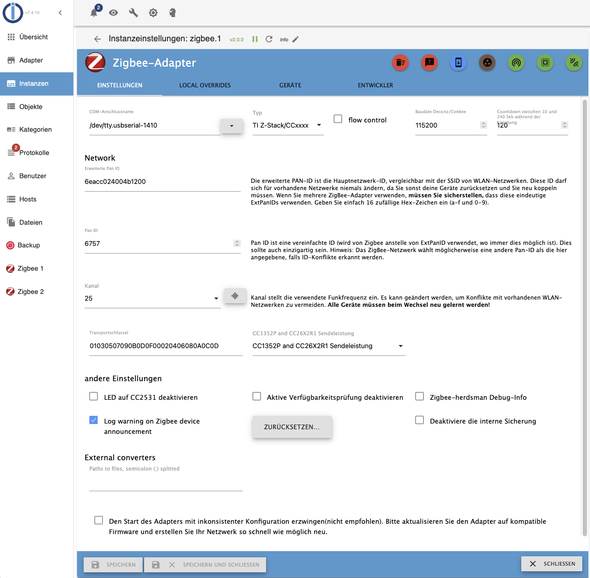

# ioBroker Adapter für Zigbee-Geräte
Mit Hilfe eines Koordinators für ZigBee-Netze, basierend auf dem Chip "Texas Instruments CC253x" (und anderen), wird ein eigenes ZigBee-Netz erschaffen, dem ZigBee-Geräte (Lampen, Dimmer, Sensoren, …) beitreten können. Dank der direkten Interaktion mit dem Koordinator erlaubt der ZigBee-Adapter die Steuerung der Geräte ohne jegliche Gateways/Bridges der Hersteller (Xiaomi/Tradfri/Hue). Zusätzliche Informationen zu ZigBee kann man hier [hier nachlesen (Englisch)](https://github.com/Koenkk/zigbee2mqtt/wiki/ZigBee-network).

## Die Hardware
Für den Koordinator (siehe oben) ist eine zusätzliche Hardware erforderlich, welche die Umsetzung zwischen USB und ZigBee-Funksignalen ermöglicht. Es gibt 2 Gruppen:

   - Aufsteckmodul für den RaspberryPi (wird nicht mehr verwendet da veraltet und keine Zigbee 3.0 Unterstützung) 
   - USB-Stick ähnliche Hardware
   - Netzwerk Koordinatoren
     

Bei manchen dieser Geräte ist zum Betrieb das Aufspielen einer geeigneten Firmware erforderlich:
Bitte schaut zuerst wie die entsprechenden Koordinatoren geflasht werden müssen. Die Firmware ist [hier](https://github.com/Koenkk/Z-Stack-firmware) zu fimden.

Zunehmend beliebt kommt der "Sonoff ZIGBEE 3.0 USB-STICK CC2652P" zum Einsatz:

   - Flashen einer passenden Firmware nicht zwingend erforderlich (Ware wird bereits mit geeigneter Firmware ausgeliefert)  
   - Unterstützt den neueren ZigBee 3.0 Standard

Die mit dem ZigBee-Netz verbundenen Geräte übermitteln dem Koordinator ihren Zustand und benachrichtigen über Ereignisse (Knopfdruck, Bewegungserkennung, Temperaturänderung, …). Diese Infos werden im Adapter unter den jeweiligen ioBroker-Objekten angezeigt und können so in ioBroker weiterverarbeitet werden. Außerdem ist es möglich Kommandos an das ZigBee-Gerät zu senden (Zustandsänderung Steckdosen und Lampen, Farb- und Helligkeitseinstellungen, …).

Eine weitergehende Aufstellung der verschiedenen Hardware-optionen für den Koordinator ist m [zigbee2mqtt.io Projekt](https://www.zigbee2mqtt.io/guide/adapters/) zu finden (Dokumentation ausschliesslich auf englisch)

## Die Software

Die Software wird unterteilt in "Konverter" und "Adapter".

   - Konverter  
    Der Konverter gliedert sich auf in zwei Teile:  
    a) Allgemeine Bereitstellung der Daten aus den ZigBee-Funksignalen. Dieser [Softwareteil](https://github.com/Koenkk/zigbee-herdsman) wird für alle ZigBee-Geräte verwendet.   
    b) Gerätespezifische [Aufbereitung](https://github.com/Koenkk/zigbee-herdsman-converters) der Daten auf eine definierte Schnittstelle zum Adapter.  
    
   - Adapter  
    Dieser Softwareteil ist die Anbindung des Konverters an ioBroker. Der [Adapter](https://github.com/ioBroker/ioBroker.zigbee) beinhaltet die grafische Darstellung zur Verwaltung der ZigBee-Geräte, sowie die Erzeugung der ioBroker-Objekte zur Steuerung der ZigBee-Geräte.
    
## Installation
1.	Koordinator Hardware am RaspberryPi anstecken. 
2.	Über z.B. PuTTY mit RaspberryPi verbinden. 
3.	Eventuell vorhandene ZigBee-Backupdatei löschen. Andernfalls wird der ZigBee-Adapter in ioBroker nicht grün und im ioBroker Log steht, dass der Adapter falsch konfiguriert ist. 
sudo rm /opt/iobroker/iobroker-data/zigbee_0/nvbackup.json 
4.	Pfad des Koordinators ermitteln. Auf Linux Systemen befindet sich dieser oft im Verzeichnis /dev/serial/by-id. Alternativ dazu werden /dev/ttyUSB*, /dev/ttyAM* (Linux), /dev/tty.usbserial-* (macOS) oder com* (windows) erwartet. 
Das folgende Beispiel zeigt eine Linux-Installation auf einem Raspberry PI. Der Befehl `ls -la /dev/serial/by-id/` erzeugt die im Bild erkennbare Ausgabe.

6.	ioBroker -> ZigBee-Adapter installieren, hier als Beispiel die Version 1.8.10       Hiermit werden alle erforderlichen Softwareteile (Konverter und Adapter) installiert.
7. Konfiguration des Adapters öffnen. Das folgende Bild zeigt das Interface ab der Version 2.0.1.  
8. Port zum Koordinator eintragen. Im Fall von USB Koordinatoren ist das der zuvor ermittelte Device-Pfad. Im Fall von über das Netzwerk angesteuerten Koordinatoren muss an Stelle des Gerätepfades die Netzwerkaddresse samt port in der Form tcp://ip:port angegeben werden. Im Beispielbild ist als Port /dev/tty.usbserial-1410 eingetragen.  Es ist zu achten, dass am Ende kein Leerzeichen mit eingetragen wird.
8.	Netzwerk-ID und Pan ID vergeben zur Unterscheidung von anderen ZigBee-Netzwerken in Funkreichweite, z.B. Wichtig: Sollte hier als erweiterte PanID die StandardID DDDDDDDDDDDDDDDD (Pan ID 6757) eingetragen sein so sollte diese **unbedingt** angepasst werden 
9. Geeigneten Zigbee-Kanal auswählen. Dabei ist zu beachten das Zigbee und 2.4GHz WLAN sich das gleiche Frequenzband teilen. Der optimale Kanal hängt also unter anderem auch von den in der Umgebung verwendeten WLan Kanälen ab. Dabei sind die Kanalbezeichnungen von Zigbee und WLan **nicht** identisch. Weiterhin ist es Sinnvoll sich bei der Auswahl auf die Zigbee Light Link Kanäle 11,15,20 und 25 zu beschränken. Sofern der Adapter erfolgreich gestartet wurde kann über die Konfiguration auch ein Scan der Netzwerkkanäle durchgeführt werden. Dabei ist zu beachten das dieses vor dem Anlernen der Geräte geschehen sollte - nach dem Wechsel des Kanals muss der Adapter angehalten und das Backup gelöscht werden. In der folge müssen alle Geräte neu angelernt werden.
10.	Prüfen ob der Adapter in ioBroker grün wird. Das kann bis zu 60 Sekunden dauern. Sollzustand:      Andernfalls ist es notwendig die Meldungen im ioBroker Log zu lesen. Diese beinhalten Informationen darüber warum der Adapter nicht gestartet wurde, und können bei der Fehlersuche mit Hilfe des Forums bereits Lösungsansätze liefern.

## Pairing
Jedes ZigBee-Gerät (Schalter, Lampe, Sensor, …) muss mit dem Koordinator gekoppelt werden (Pairing):   

   - ZigBee-Gerät:
    Jedes **ZigBee-Gerät** kann nur mit genau 1 ZigBee-Netzwerk verbunden sein. Hat das ZigBee-Gerät noch Pairing-Informationen zu einem fremden Koordinator (z.B. Philips Hue Bridge) gespeichert, dann muss es von diesem ZigBee-Netzwerk zuerst entkoppelt werden. Dieses Entkoppeln vom alten ZigBee-Netzwerk erfolgt vorzugsweise über die Bedienoberfläche des alten ZigBee-Netzwerkes (z.B. Philips Hue App). Alternativ kann man das ZigBee-Gerät auf Werkseinstellungen zurücksetzen.   
    Um ein ZigBee-Gerät nun in den Pairing-Mode zu versetzen, gibt es typischerweise folgende Möglichkeiten:  
        1.	ZigBee-Gerät von einem ZigBee-Netzwerk entkoppeln  
        2.	Pairing-Button am ZigBee-Gerät drücken (ggf. mehrfach) 
        3.	Versorgungsspannung des ZigBee-Gerätes aus- und dann wieder einschalten  (ggf. mehrfach)
      
Danach ist das ZigBee-Gerät für typischerweise 60 Sekunden im Pairing-Mode.  
Ähnlich wie die Vorgehensweise zum Rücksetzen auf Werkseinstellungen ist auch das Aktivieren des Pairing-Mode abhängig vom jeweiligen Gerätetyp (ggf. Bedienungsanleitung des ZigBee-Gerätes lesen).   

   - Koordinator:
Grünen Knopf drücken, um den Koordinator für 60 Sekunden (oder die in den Adaptereinstellungen gewählte Zeit) in den Pairing-Mode zu versetzen.  

   - Warten bis im Dialog `Interview Successful` erscheint: 

   - Pairing überprüfen:
Das zu koppelnde Gerät muss vom ioBroker ZigBee-Adapter unterstützt werden. Im Gutfall wird im ZigBee-Adapter ein neues Gerät angezeigt (z.B. Philips Light Stripe) mit dem Hinweis `"supported":true` und entsprechende ioBroker-Objekte angelegt: 
 

   - Im Schlechtfall wird das ZigBee-Gerät aktuell noch nicht unterstützt. Im nächsten Abschnitt ist beschrieben, was zu tun ist, um dieses ZigBee-Gerät dennoch nutzen zu können.

## Pairing von bisher unbekannten ZigBee-Geräten

Bei bisher unbekannten ZigBee-Geräten erscheint beim Pairing der ZigBee-Name des ZigBee-Gerätes (z.B. HOMA1001) mit dem Zusatz `"supported": false`  
  

Durch Drehen dieser Kachel erhält man Detailinformationen zu dem ZigBee-Gerät:  
   

Nach einer Registrierung bei [github.com](https://github.com/ioBroker/ioBroker.zigbee/issues) kann über einen "Issue" das fehlende ZigBee-Gerät gemeldet werden:

  

Detailinformationen der Kachel (siehe oben) in dem Issue einfügen, erstelle eine kurze Dokumentation (vorzugweise auf Englisch) und absenden. Ein Entwickler wird sich daraufhin über den Issue melden.

Als Ergebnis kommt eine von zwei Möglichkeiten in Frage:
- Anpassung an den Zigbee-Herdsman-Converters. Dieses erfordert eine aktualiserte Version des Zigbee-Adapters, der zunächst getestet und dann im Latest Repository zur Verfügung gestellt wird
- Erstellung eines "externen Konverters" - einer Datei mit JS Code welche in das Datenverzeichnis des Zigbee-Adapters kopiert und in der Konfiguration des Adapters angegeben werden kann.
In Beiden Fällen ist es hinreichend den Adapter neu zu starten - die entsprechend angepassten Datenpunkte des Adapters werden angelegt. Sofern dabei Datenpunkte nicht weiter unterstützt werden so werden diese in orange eingefärbt und der Adapter zeigt die Schaltfläche zum löschen der verwaisten Datenpunkte an.

## Symbole im ZigBee-Adapter
    
| Bild                | Beschreibung                                                                                                                                                                                                                                                                                                                                                                                                                                                                                                                                                                                                                                                                                                 |
|---------------------|--------------------------------------------------------------------------------------------------------------------------------------------------------------------------------------------------------------------------------------------------------------------------------------------------------------------------------------------------------------------------------------------------------------------------------------------------------------------------------------------------------------------------------------------------------------------------------------------------------------------------------------------------------------------------------------------------------------|
|  | **State Cleanup**   Löschen von ungültigen ioBroker-Objekten, welche durch den Vorgang "Ausschliessen" entstehen können.                                                                                                                                                                                                                                                                                                                                                                                                                                                                                                                                                                                  |
|  | **Auf Firmware Updates überprüfen**   Firmware der ZigBee-Geräte (z.B. Philips Hue Lampen) aktualisieren                                                                                                                                                                                                                                                                                                                                                                                                                                                                                                                                                                                                  |
|  | **Add Group**   Über diese Funktion können mehrere ZigBee-Geräte zu einer logischen Gruppe zusammengefasst werden und dann über ein ioBroker-Objekt gemeinsam angesteuert werden, z.B. brightness=20 dann wird bei allen ZigBee-Geräten der Gruppe brightness auf 20 gesetzt.                                                                                                                                                                                                                                                                                                                                                                                                                             |
|  | **Touchlink zurücksetzen und koppeln**   Touchlink ist eine Funktion von ZigBee, die es physisch nahe beieinander liegenden Geräten ermöglicht, miteinander zu kommunizieren, ohne sich im selben Netzwerk zu befinden. Diese Funktion wird nicht von allen Geräten unterstützt. Um ein ZigBee-Gerät über Touchlink auf Werkseinstellungen zurückzusetzen, bringe das Gerät in die Nähe (< 10 cm) des ZigBee-Koordinators und drücke dann das grüne Symbol.                                                                                                                                                                                                                                               |
|  | **Pairing mit QR Code**   Bei manchen ZigBee-Geräten erfolgt das Pairing mittels QR-Code.                                                                                                                                                                                                                                                                                                                                                                                                                                                                                                                                                                                                                 |
|  | **Pairing**    Anlernvorgang neuer ZigBee-Geräte (Pairing) starten.                                                                                                                                                                                                                                                                                                                                                                                                                                                                                                                                                                                                                                       |
|  | Zeit seit mit diesem ZigBee-Gerät    zuletzt ein Datenaustausch stattgefunden hat.                                                                                                                                                                                                                                                                                                                                                                                                                                                                                                                                                                                                                        |
|  | Stärke des ZigBee-Funksignals   an diesem ZigBee-Gerät (<10 schlecht, <50 mittel, >50 gut).ZigBee ist ein Funk-Mesh-Netzwerk (mesh = vermascht). Die meisten netzbetriebenen ZigBee-Geräte (z.B. Philips Hue Lampe) können als ZigBee-Router wirken, also als Funkknotenpunkt. ZigBee-Geräte müssen somit nicht zwingend eine direkte Funkverbindung zum Koordinator aufbauen, sondern können stattdessen jeden Router im Netzwerk zur Funkverbindung nutzen. Mit jedem ZigBee-Router wird somit die Funkreichweite des Netzwerkes erweitert. Alle ZigBee-Geräte prüfen regelmäßig, ob es eine bessere Funkroute gibt und stellen sich automatisch um. Dieser Vorgang kann jedoch etliche Minuten dauern. |

## Zusätzliche Informationen
Es gibt noch ein [Freundschaftsprojekt](https://www.zigbee2mqtt.io/) mit gleichen Funktionen und gleicher Technologie, welcher mit denselben Geräten über ein MQTT Protokoll kommuniziert. Wenn irgendwelche Verbesserungen oder neu unterstütze Geräte im Projekt ZigBee2MQTT eingefügt werden, können jene auch in dieses Projekt hinzugefügt werden. Solltet Ihr Unterschiede merken, schreibt bitte ein Issue und wir kümmern uns darum.
Weitere Themen zu diesem Adapter sind auch im zugehörigen [Wiki](https://github.com/ioBroker/ioBroker.zigbee/wiki) dokumentiert.

