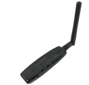

# ioBroker adapter for ZigBee devices
With the help of a coordinator, based on the chip "Texas Instruments CC253x" (and others), a ZigBee network is created for ZigBee devices (bulbs, dimmers, sensors, …) to join. Thanks to the direct interaction with the coordinator, the ZigBee adapter allows to control the devices without any manufacturer gateways/bridges (Xiaomi/Tradfri/Hue). Additional information about ZigBee can be found [here](https://github.com/Koenkk/zigbee2mqtt/wiki/ZigBee-network).

## Hardware
Additional hardware is required for the coordinator (see above), which enables conversion between USB and ZigBee radio signals. There are 2 groups:

•	Attachment module for the RaspberryPi (its old and not supported Zigbee V3) 
•	USB stick like hardware

Some of these devices require the installation of a suitable firmware for operation:
The required flasher/programmer and the process of preparation are described [here](https://github.com/Koenkk/zigbee2mqtt/wiki/Getting-started) or [here (Russioan)](https://github.com/kirovilya/ioBroker.zigbee/wiki/%D0%9F%D1%80%D0%BE%D1%88%D0%B8%D0%B2%D0%BA%D0%B0). 

The "Sonoff ZIGBEE 3.0 USB STICK CC2652P" is becoming increasingly popular:

   - Flashing of a suitable firmware is not absolutely necessary (hardware is already delivered with suitable firmware) 
   - Supports the newer ZigBee 3.0 standard

The devices connected to the ZigBee network transmit their status to the coordinator and notify it of events (button press, motion detection, temperature change, ...). This information is displayed in the adapter under the respective ioBroker objects and can thus be further processed in ioBroker. It is also possible to send commands to the ZigBee device (change of status of sockets and lamps, color and brightness settings, ...).

## Software

The software is divided into "converter" and "adapter".

   - Converter
    The converter is divided into two parts:  
      a) General provision of the data from the ZigBee radio signals. This [software part](https://github.com/Koenkk/zigbee-herdsman) is used for all ZigBee devices.  
      b) Device-specific [processing](https://github.com/Koenkk/zigbee-herdsman-converters) of the data to a defined interface to the adapter.
   - Adapter 
      This software part is the connection of the converter to ioBroker. The [adapter](https://github.com/ioBroker/ioBroker.zigbee) includes the graphical user interface for managing the ZigBee devices and the creation of ioBroker objects for controlling the ZigBee devices.

    
## Installation
1.	Koordinator Hardware am RaspberryPi anstecken. 
2.	Über z.B. PuTTY mit RaspberryPi verbinden. 
3.	Eventuell vorhandene ZigBee-Backupdatei löschen. Andernfalls wird der ZigBee-Adapter in ioBroker nicht grün und im ioBroker Log steht, dass der Adapter falsch konfiguriert ist. 
sudo rm /opt/iobroker/iobroker-data/zigbee_0/nvbackup.json 
4.	Pfad des Koordinators ermitteln:
`ls -la /dev/serial/by-id/`

5.	ioBroker -> ZigBee-Adapter installieren, hier als Beispiel die Version 1.8.10       Hiermit werden alle erforderlichen Softwareteile (Konverter und Adapter) installiert.
6.	Adapter öffnen ->  -> Zuvor ermittelten Pfad des Koordinators mit dem Zusatz /dev/serial/by-id/ eintragen:   es ist zu achten dass am Ende kein leer Zeichen mitgenommen wird
7.	Netzwerk-ID und Pan ID vergeben zur Unterscheidung von anderen ZigBee-Netzwerken in Funkreichweite, z.B.  
        
8.	Prüfen ob der Adapter in ioBroker grün wird. Sollzustand:      Andernfalls ioBroker Log lesen und Fehlerursache suchen, im Forum stehen viele Lösungsansätze.

## Pairing
Jedes ZigBee-Gerät (Schalter, Lampe, Sensor, …) muss mit dem Koordinator gekoppelt werden (Pairing):   

   - ZigBee-Gerät:
    Jedes **ZigBee-Gerät** kann nur mit genau 1 ZigBee-Netzwerk verbunden sein. Hat das ZigBee-Gerät noch Pairing-Informationen zu einem fremden Koordinator (z.B. Philips Hue Bridge) gespeichert, dann muss es von diesem ZigBee-Netzwerk zuerst entkoppelt werden. Dieses Entkoppeln vom alten ZigBee-Netzwerk erfolgt vorzugsweise über die Bedienoberfläche des alten ZigBee-Netzwerkes (z.B. Philips Hue App). Alternativ kann man das ZigBee-Gerät auf Werkseinstellungen zurücksetzen.   
    Um ein ZigBee-Gerät nun in den Pairing-Mode zu versetzen, gibt es typischer Weise folgende Möglichkeiten:   
        1.	ZigBee-Gerät von einem ZigBee-Netzwerk entkoppeln  
        2.	Pairing-Button am ZigBee-Gerät drücken  
        3.	Versorgungsspannung des ZigBee-Gerätes aus- und dann wieder einschalten  
      
Danach ist das ZigBee-Gerät für typischer Weise 60 Sekunden im Pairing-Mode.  
Ähnlich wie die Vorgehensweise zum Rücksetzen auf Werkseinstellungen ist auch das Aktivieren des Pairing-Mode abhängig vom jeweiligen Gerätetyp (ggf. Bedienungsanleitung des ZigBee-Gerätes lesen).   

   - Koordinator:
Grünen Knopf drücken, um den Koordinator für 60 Sekunden (oder singestellte Zeit im Adapter Einstellungen) in den Pairing-Mode zu versetzen.  

   - Warten bis im Dialog "New device joined" erscheint: 

   - Pairing überprüfen:
Das zu koppelnde Gerät muss vom ioBroker ZigBee-Adapter unterstützt werden. Im Gutfall wird im ZigBee-Adapter ein neues Gerät angezeigt (z.B. Philips Light Stripe) und entsprechende ioBroker-Objekte angelegt:
 

   - Im Schlechtfall wird das ZigBee-Gerät aktuell noch nicht unterstützt. Im nächsten Abschnitt ist beschrieben, was zu tun ist, um dieses ZigBee-Gerät dennoch nutzen zu können.

## Pairing von bisher unbekannten ZigBee-Geräten

Bei bisher unbekannten ZigBee-Geräten erscheint beim Pairing der ZigBee-Name des ZigBee-Gerätes (z.B. HOMA1001) mit dem Zusatz "not described in statesMapping"  
  
  

Durch Drehen dieser Kachel erhält man Detailinformationen zu dem ZigBee-Gerät:  
   

Nach einer Registrierung bei [github.com](https://github.com/ioBroker/ioBroker.zigbee/issues) kann über einen "Issue" das fehlende ZigBee-Gerät gemeldet werden:

  

•	Detailinformationen der Kachel (siehe oben) in den Issue einfügen, erstelle eine kurze Dokumentation (vorzugweise auf Englisch) und absenden. Ein Entwickler wird sich daraufhin über den Issue melden.

Nach Anpassung der relevanten Dateien muss der ZigBee-Adapter neugestartet und dann das ZigBee-Gerät vom Koordinator entkoppelt werden (unpair):
  
Danach kann das Pairing wiederholt werden. Sollzustand nach dem Pairing:  
  

Bei manchen ZigBee-Geräten ist es erforderlich alle Softwareschnittstellen ("exposes") des neuen ZigBee-Gerätes in den ioBroker-Objekten anzuzeigen, um alle Funktionen des ZigBee-Gerätes nutzen zu können. In solchen Fällen muss das neue ZigBee-Gerät in die "Ausschliessen"-Gruppe aufgenommen werden. 

  

 ->  ->  -> ZigBee-Gerät (z.B. HOMA1001) auswählen  ->      
Nach einem Neustart des ZigBee-Adapters sollte das neue ZigBee-Gerät nun uneingeschränkt funktionieren.

## Symbole im ZigBee-Adapter
    
| icon  | Beschreibung |
| ------------- | ------------- |
|   | **State Cleanup** Löschen von ungültigen ioBroker-Objekten, welche durch den Vorgang "Ausschliessen" entstehen können. |
|   | **Auf Firmware Updates überprüfen** Firmware der ZigBee-Geräte (z.B. Philips Hue Lampen) aktualisieren  |
|   | **Add Group** Über diese Funktion können mehrere ZigBee-Geräte zu einer logischen Gruppe zusammengefasst werden und dann über ein ioBroker-Objekt gemeinsam angesteuert werden, z.B. brightness=20 dann wird bei allen ZigBee-Geräten der Gruppe brightness auf 20 gesetzt. |
|   | **Touchlink zurücksetzen und koppeln** Touchlink ist eine Funktion von ZigBee, die es physisch nahe beieinander liegenden Geräten ermöglicht, miteinander zu kommunizieren, ohne sich im selben Netzwerk zu befinden. Diese Funktion wird nicht von allen Geräten unterstützt. Um ein ZigBee-Gerät über Touchlink auf Werkseinstellungen zurückzusetzen, bringe das Gerät in die Nähe (< 10 cm) des ZigBee-Koordinators und drücke dann das grüne Symbol. |
|   | **Pairing mit QR Code** Bei manchen ZigBee-Geräten erfolgt das Pairing mittels QR-Code. |
|   | **Pairing**  Anlernvorgang neuer ZigBee-Geräte (Pairing) starten. |
|   | Zeit seit mit diesem ZigBee-Gerät zuletzt ein Datenaustausch stattgefunden hat.  |
|   | Stärke des ZigBee-Funksignals an diesem ZigBee-Gerät (<10 schlecht, <50 mittel, >50 gut).ZigBee ist ein Funk-Mesh-Netzwerk (mesh = vermascht). Die meisten netzbetriebenen ZigBee-Geräte (z.B. Philips Hue Lampe) können als ZigBee-Router wirken, also als Funkknotenpunkt. ZigBee-Geräte müssen somit nicht zwingend eine direkte Funkverbindung zum Koordinator aufbauen, sondern können stattdessen jeden Router im Netzwerk zur Funkverbindung nutzen.Mit jedem ZigBee-Router wird somit die Funkreichweite des Netzwerkes erweitert. Alle ZigBee-Geräte prüfen regelmäßig, ob es eine bessere Funkroute gibt und stellen sich automatisch um. Dieser Vorgang kann jedoch etliche Minuten dauern.|

## Zusätzliche Informationen
Es gibt noch ein [Freundschaftsprojekt](https://www.zigbee2mqtt.io/) mit gleichen Funktionen und gleicher Technologie, welcher mit denselben Geräten über ein MQTT Protokoll kommuniziert. Wenn irgendwelche Verbesserungen oder neu unterstütze Geräte im Projekt ZigBee2MQTTeingefügt werden, können jene auch in dieses Projekt hinzugefügt werden. Solltet Ihr Unterschiede merken, schreibt bitte ein Issue und wir kümmern uns darum.
Weitere Themen zu diesem Adapter sind auch im zugehörigen Wiki dokumentiert.

