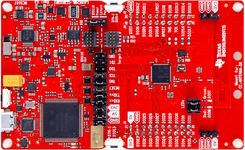

# ioBroker adapter for ZigBee devices
With the help of a coordinator, based on the chip "Texas Instruments CC253x" (and others), a ZigBee network is created for ZigBee devices (bulbs, dimmers, sensors, …) to join. Thanks to the direct interaction with the coordinator, the ZigBee adapter allows to control the devices without any manufacturer gateways/bridges (Xiaomi/Tradfri/Hue). Additional information about ZigBee can be found [here](https://github.com/Koenkk/zigbee2mqtt/wiki/ZigBee-network).

## Hardware
Additional hardware is required for the coordinator (see above), which enables conversion between USB and ZigBee radio signals. There are 2 groups:

• Attachment module for the RaspberryPi (It's old and not supported Zigbee V3) 
•	USB stick like hardware

Some of these devices require the installation of suitable firmware for operation:
The required flasher/programmer and the process of preparation are described [here](https://github.com/Koenkk/zigbee2mqtt/wiki/Getting-started) or [here (Russian)](https://github.com/kirovilya/ioBroker.zigbee/wiki/%D0%9F%D1%80%D0%BE%D1%88%D0%B8%D0%B2%D0%BA%D0%B0). 

The "Sonoff ZIGBEE 3.0 USB STICK CC2652P" is becoming increasingly popular:

   - Flashing of suitable firmware is not absolutely necessary (hardware is already delivered with suitable firmware)
   - Supports the newer ZigBee 3.0 standard

The devices connected to the ZigBee network transmit their status to the coordinator and notify it of events (button press, motion detection, temperature change, ...). This information is displayed in the adapter under the respective ioBroker objects and can thus be further processed in ioBroker. It is also possible to send commands to the ZigBee device (change of status of sockets and lamps, color and brightness settings, ...).

## Software

The software is divided into "converter" and "adapter".

   - Converter
    The converter is divided into two parts:  
      a) General provision of the data from the ZigBee radio signals. This [software part](https://github.com/Koenkk/zigbee-herdsman) is used for all ZigBee devices.  
      b) Device-specific [processing](https://github.com/Koenkk/zigbee-herdsman-converters) of the data to a defined interface to the adapter.
   - Adapter 
      This software part is the connection of the converter to ioBroker. The [adapter](https://github.com/ioBroker/ioBroker.zigbee) includes the graphical user interface for managing the ZigBee devices and the creation of ioBroker objects for controlling the ZigBee devices.

    
## Installation
1.	Connect the coordinator hardware to the RaspberryPi. 
2.	Connect to RaspberryPi, e.g., via PuTTY. 
3.	Delete any existing ZigBee backup file. Otherwise, the ZigBee adapter will not turn green in ioBroker and the ioBroker log will state that the adapter is misconfigured  
4.	Find out the path of the coordinator :
`ls -la /dev/serial/by-id/`

5.	ioBroker -> install ZigBee adapter, here Version 1.8.10       This will install all the necessary software parts (converter and adapter).
6.	Open adapter ->  -> Enter the previously determined path of the coordinator with the addition /dev/serial/by-id/:   There must be NO spaces at the end of the path.
7.	Configure network ID and Pan ID to differentiate from other ZigBee networks within radio range, e.g.  
        
8.	Check if the adapter turns green in ioBroker. Target state:      Otherwise read the ioBroker log and look for the cause of the error, check also our Forum.

## Pairing
Each ZigBee device (switch, bulb, sensor, ...) must be paired with the coordinator (pairing):   

   - ZigBee device:
    Each ZigBee device can only be connected to exactly 1 ZigBee network. If the ZigBee device still has pairing information saved for a different coordinator (e.g. Philips Hue Bridge), then it must first be decoupled from this ZigBee network. This decoupling from the old ZigBee network preferably is done via the user interface of the old ZigBee network (z.B. Philips Hue App). Alternatively, you can reset the ZigBee device to factory settings.   
There are typically the following options for putting a ZigBee device into pairing mode      
        1.	Unpair a ZigBee device from a ZigBee network
        2.	Press the pairing button on the ZigBee device  
        3.	Switch the supply voltage of the ZigBee device off and then on again

      
The ZigBee device is then in pairing mode for typically 60 seconds. Similar to the procedure for resetting to factory settings, activating the pairing mode also depends on the respective device type (if necessary, read the operating instructions of the ZigBee device).

   - Coordinator:
Press the green button to put the coordinator into pairing mode for 60 seconds.  

   - Wait until "New device joined" appears in the dialog:   

   - Check Pairing:
The device to be paired must be supported by the ioBroker ZigBee adapter. In the best case, a new device is displayed in the ZigBee adapter (e.g. Philips Light Stripe) and corresponding ioBroker objects are created:
 

   - In the worst case, the ZigBee device is not currently supported. The next section describes what needs to be done to use this ZigBee device anyhow.

## Pairing of unknown ZigBee devices so far

With unknown ZigBee devices so far, the ZigBee name of the ZigBee device (e.g., HOMA1001) appears during pairing with the addition "not described in statesMapping"  
  
  

Turning this tile gives you detailed information about the ZigBee device:  
   

After registering at [github.com](https://github.com/ioBroker/ioBroker.zigbee/issues) the missing ZigBee device must be reported via an "Issue":

  

   - Insert detailed information of the tile (see above) into the issue, create short documentation (preferably in English) and send it. A developer will then respond via the issue.

After modifying the relevant files, the ZigBee adapter must be restarted, and the ZigBee device must be unpaired from the coordinator:
  
After that, the pairing can be repeated. Target state after pairing:  
  

With some ZigBee devices, it is necessary to display all software interfaces ("exposes") of the new ZigBee device in the ioBroker objects in order to be able to use all the functions of this ZigBee device. In such cases, the new ZigBee device must be included in the "Exclude" group.

  

 ->  ->  -> select ZigBee device (e.g. HOMA1001)  ->      
After restarting the ZigBee adapter, the new ZigBee device should now work without restrictions.

## Symbols within the ZigBee adapter
    
| Icon                       | Description                                                                                                                                                                                                                                                                                                                                                                                                                                                                                                                                                                                                                                                                  |
|----------------------------|------------------------------------------------------------------------------------------------------------------------------------------------------------------------------------------------------------------------------------------------------------------------------------------------------------------------------------------------------------------------------------------------------------------------------------------------------------------------------------------------------------------------------------------------------------------------------------------------------------------------------------------------------------------------------|
|   | **State Cleanup** Deletion of invalid ioBroker objects, which can result from the "Exclude" process.                                                                                                                                                                                                                                                                                                                                                                                                                                                                                                                                                                         |
|   | **Check firmware updates** Update the firmware of the ZigBee devices (e.g. Philips Hue bulbs).                                                                                                                                                                                                                                                                                                                                                                                                                                                                                                                                                                               |
|   | **Add Group** Using this function, ZigBee devices can be combined into a logical group and then be controlled together via one ioBroker object, e.g. brightness=20 sets the brightness of all ZigBee devices in the group to 20.                                                                                                                                                                                                                                                                                                                                                                                                                                             |
|   | **Touchlink reset and pairing** Touchlink is a ZigBee function that allows devices that are physically close to each other to communicate with each other without being in the same network. Not all devices support this feature.To factory reset a ZigBee device via Touchlink, bring the device close (< 10 cm) to the ZigBee coordinator and then press this green icon.                                                                                                                                                                                                                                                                                                 |
|   | **Pairing with QR code** Bei With some ZigBee devices, pairing is done using a QR code.                                                                                                                                                                                                                                                                                                                                                                                                                                                                                                                                                                                      |
|   | **Let's start Pairing**  Start the pairing process for new ZigBee devices.                                                                                                                                                                                                                                                                                                                                                                                                                                                                                                                                                                                                   |
|   | Time since data was last exchanged with this ZigBee device.                                                                                                                                                                                                                                                                                                                                                                                                                                                                                                                                                                                                                  |
|   | Strength of the ZigBee radio signal at this ZigBee device (<10 poor, <50 medium, >50 good).ZigBee is a wireless mesh network. Most mains-operated ZigBee devices (e.g. Philips Hue bulbs) can act as a ZigBee router, this means as a radio node. ZigBee devices therefore do not necessarily have to establish a direct wireless connection to the coordinator, but can instead use any router in the network for the wireless connection. The radio range of the network is thus extended with each ZigBee router. All ZigBee devices regularly check whether there is a better radio route and switch over automatically. However, this process can take several minutes. |

## Additional information
There is [another](https://www.zigbee2mqtt.io/) with the same functions and the same technology, which communicates with the same devices via an MQTT protocol. If any improvements or new supported devices are included in the ZigBee2MQTT project, those can also be added to this project. If you notice any differences, please write an issue and we will take care of it.
Other topics related to this adapter are also documented in the associated wiki.

